# Remote SSH dari AWS EC2 Server

1. unduh dan Install Putty di https://www.chiark.greenend.org.uk/~sgtatham/putty/latest.html
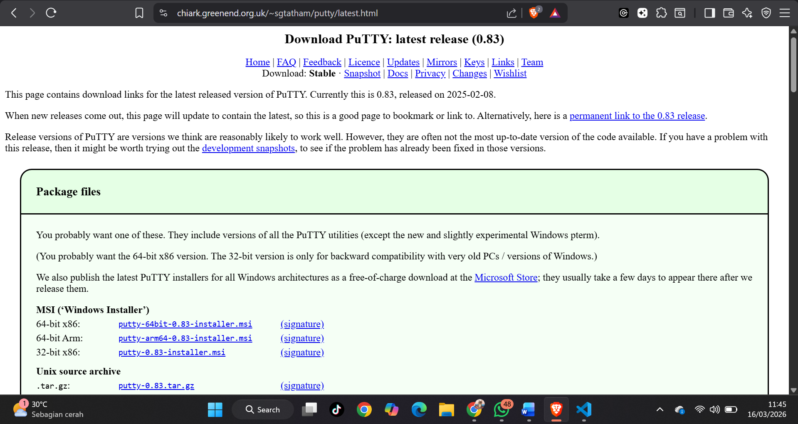
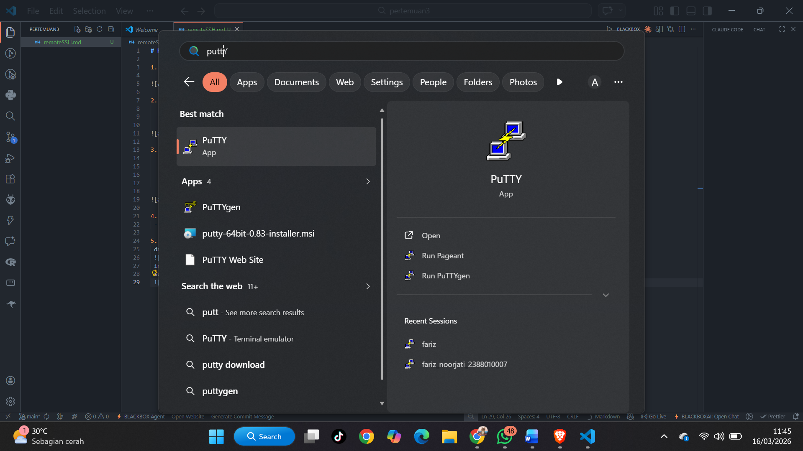

2. Konversi ekstensi Private Key dari .pem menjadi .ppk
    - Buka Putty Gen
    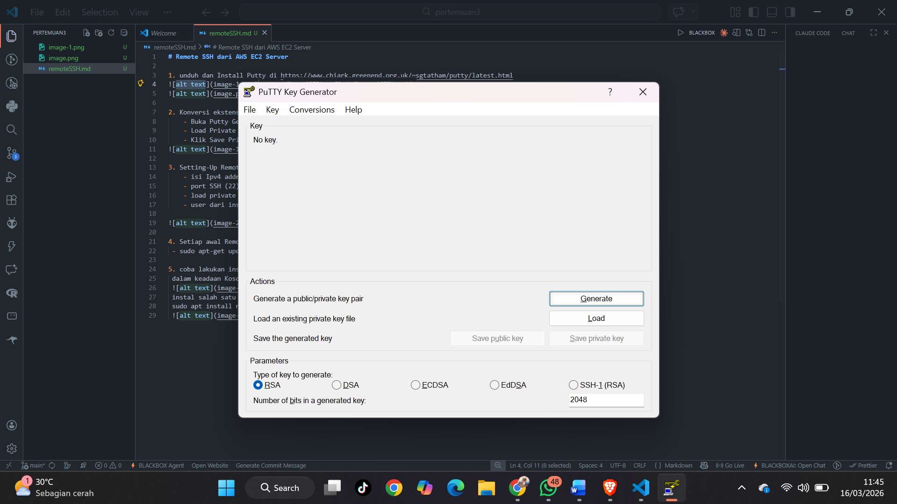
    - Load Private Key .pem 
    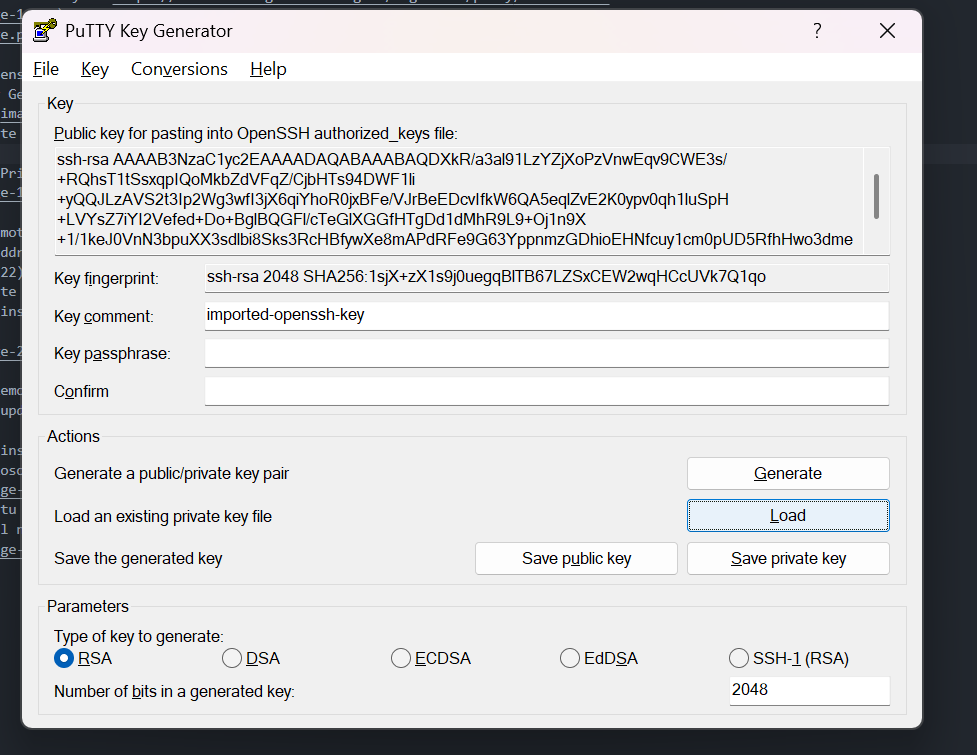
    - Klik Save Private Key menjadi ekstensi File .ppk
    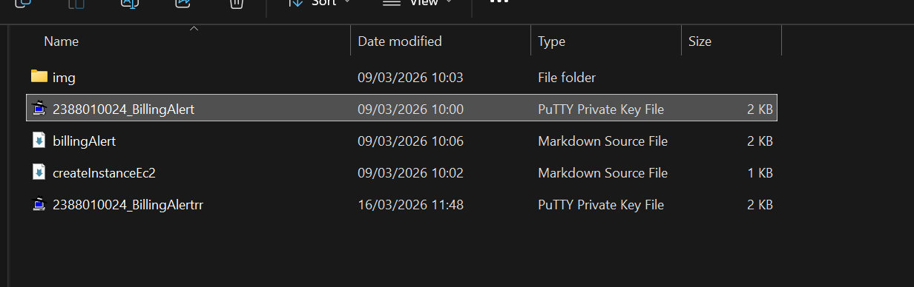

3. Setting-Up Remote SSH dengan Putty
    - isi Ipv4 addres Public data berasal dari instance masing2
    
    - port SSH (22)
    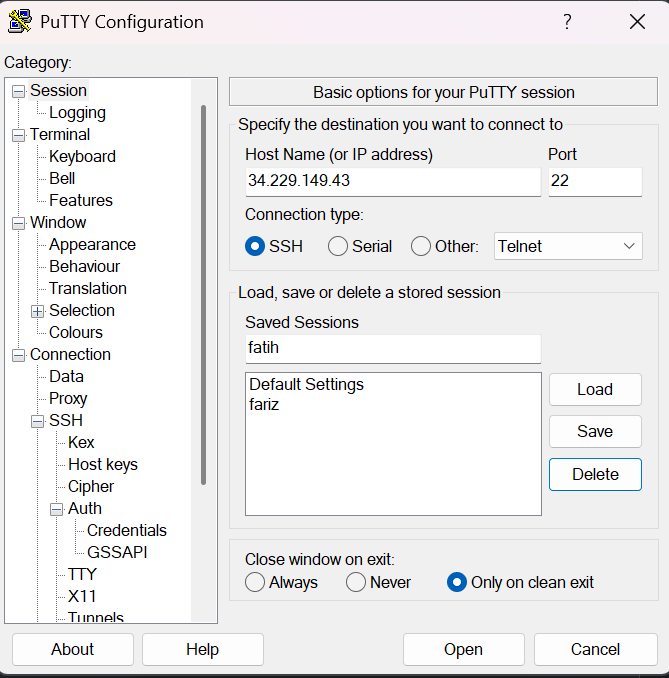
    - load private key .ppk di menu Connection->SSH->Auth->Credential
    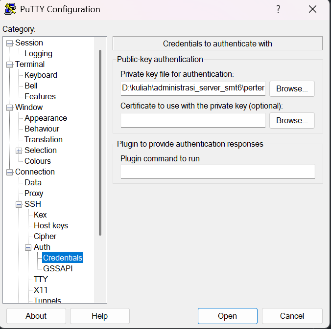
    - user dari instance masing-masing (ubuntu)
    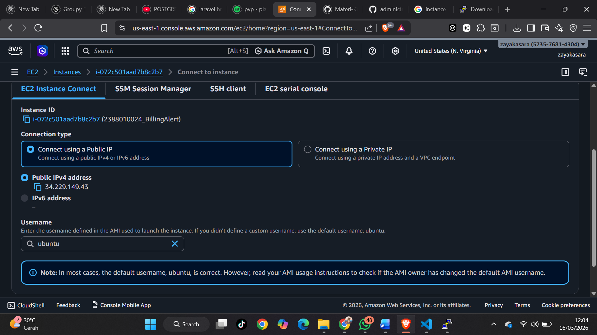

4. Setiap awal Remote kita lakukan Patching OS
 - sudo apt-get update && sudo apt-get upgrade 
 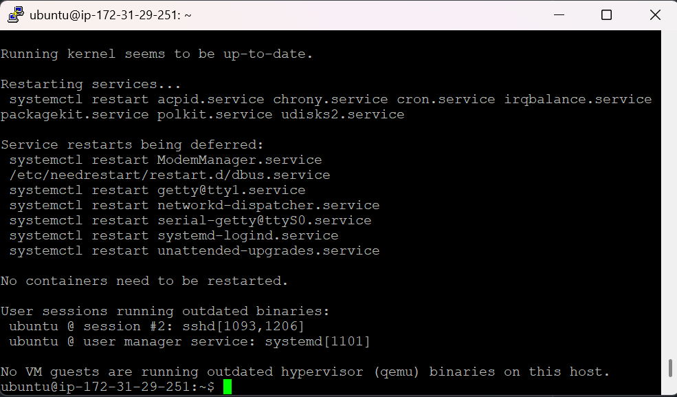

5. coba lakukan instalasi Web Server 
 dalam keadaan Kosong
 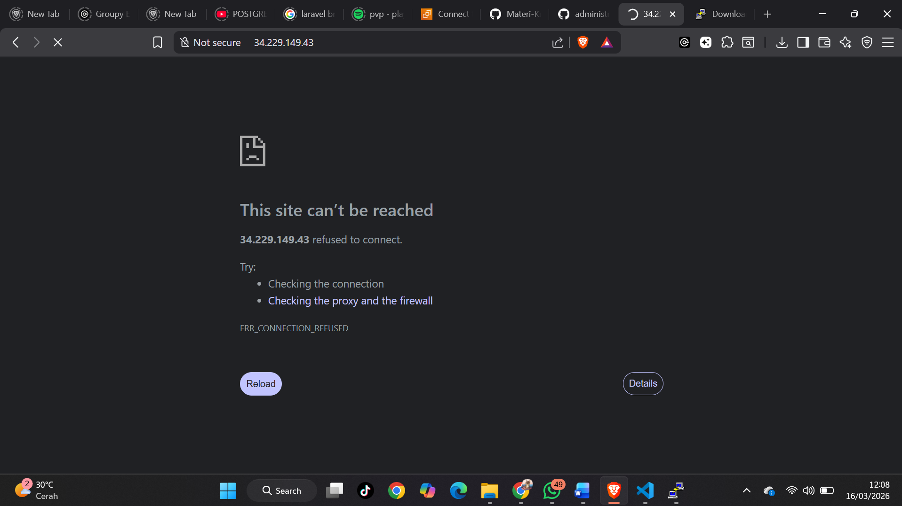
 instal salah satu web server 
 sudo apt install nginx 
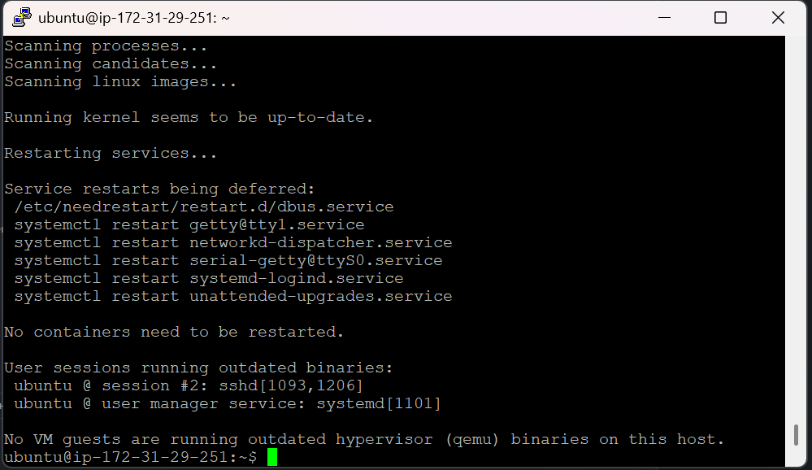
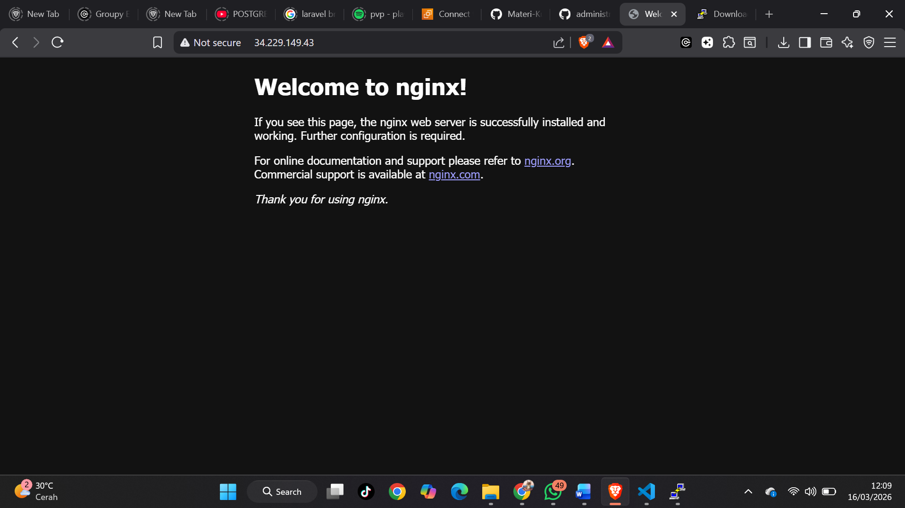
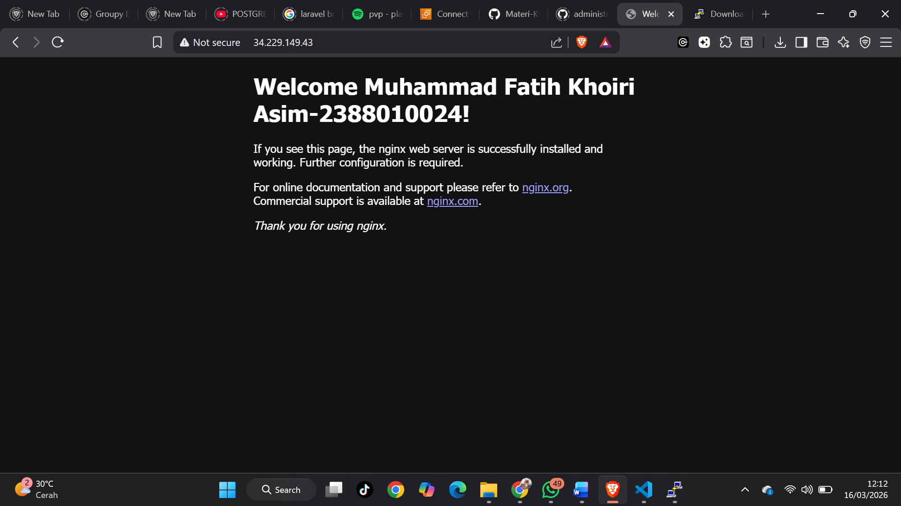